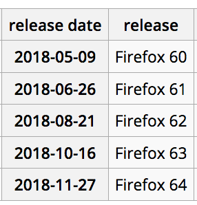

## The /whatsnew page

* RASCI

* How it works: /whatsnew page functionality (who is shown the content)

* How to enable it

* The Checklist - Cautionary tales and tasks before launching updates

* Product release schedule

* Metrics

### RASCI

| Repsonsible  | Accountable  | Supporting   | Consulted  | Informed   |
| ------------- |:-------------:| -----:| -----:| -----:|
| David Tenser | Michele Warther | website team   retention team   release engineering | Tim or Yuliya - Creative   Peter D   Madhava   Cherry   | Eric Petitt Porfirio L Kerry Cherry |

### How it works: /whatsnew page functionality (who is shown the content)

The way it works, on bedrock (this functionality is in place on production):

Older major version:
A user on Firefox not logged into their Firefox Account that is updating from older major version gets the /whatsnew page w. Fx Account CTA: https://www.mozilla.org/en-US/firefox/59.0/whatsnew/?oldversion=58.0
A user on Firefox logged in to their Firefox Account that is updating from older major version gets the /whatsnew page w. mobile CTA (QR code only): https://www.mozilla.org/en-US/firefox/59.0/whatsnew/?oldversion=58.0

Older minor version:
A user on Firefox  updating from an older minor version gets the /whatsnew page w. mobile CTA: https://www.mozilla.org/en-US/firefox/59.0.1/whatsnew/?oldversion=59.0

### How to enable it

Requirements to enable:

* Release Engineering needs to point to the /whatsnew URL, PER LOCALE in the build itself
* Content must be in place for each locale selected with lang files complete to 100%
* A bug requesting this must be filed for each release (e.g. 58.0) AND dot release (e.g. - 59.0.1) unless other arrangements have been made w. release engineering
* Previous bugs

| Release  | Releng bug  | moz.org bug   |
| ------------- |:-------------:| -----:|
| 60  |  | [1457024](https://bugzilla.mozilla.org/show_bug.cgi?id=1444486) |
| 59  | [1444486](https://bugzilla.mozilla.org/show_bug.cgi?id=1444486) |  |
| 58  | [1428419](https://bugzilla.mozilla.org/show_bug.cgi?id=1428419) | [1416817](https://bugzilla.mozilla.org/show_bug.cgi?id=1416817) |
| 57  |  |  |
| 56  |  |  |
| 55  |  |  |
| 54  |  |  |

### The Checklist - Cautionary tales and tasks before launching updates

### Product release schedule

<i>[Check here for updates](https://wiki.mozilla.org/Release_Management/Calendar)</i>

### Metrics

 Release  |
| ------------- |
| [60](https://datastudio.google.com/org/Ra9O2QIYT8We-1pOmnS_6w/reporting/0B6voOaUZL-jwMi1yNUJ4U1hnc28/page/w7YR)  | 
